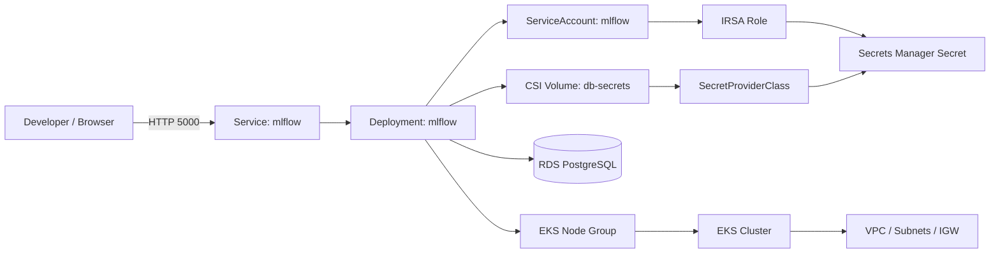
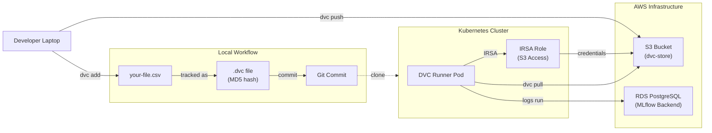

# MLflow on EKS Sandbox

This repository provisions a lightweight AWS EKS environment for MLflow and connects it to an RDS PostgreSQL database using Secrets Store CSI Driver with the AWS Secrets Manager provider (ASCP). This replaces the older approach of using a Python-based AWS CLI init container for secret retrieval.

## What this project creates

- An EKS cluster with a managed node group
- A VPC, subnets, internet gateway, and routing
- An RDS PostgreSQL instance for MLflow metadata
- A Secrets Manager secret containing the DB connection values
- An IAM role for service-account-based access to Secrets Manager (IRSA)
- The Secrets Store CSI Driver and AWS provider installed in the cluster
- A SecretProviderClass, Deployment, Service, and ingress routing for MLflow

## Architecture



## Repository layout

- [infrastructure/](infrastructure/) — Terraform code for AWS resources (EKS, RDS, S3 for DVC, IAM roles)
- [k8s/](k8s/) — Kubernetes manifests for the MLflow app, CSI secret provider, and DVC runners
- [data-science/](data-science/) — ML pipeline with DVC data versioning and MLflow experiment tracking

## Prerequisites

Before you start, make sure you have:

- AWS CLI configured with sandbox credentials
- Terraform installed
- kubectl installed
- Helm installed (used by the Terraform Helm provider)
- `envsubst` available for substituting the `MLFLOW_HOST` value into `mlflow-ingressroute.yaml`
- Access to the target AWS account and region

Verify your AWS CLI setup:

```bash
aws sts get-caller-identity
aws configure
```

## Deployment flow

### 1) Bootstrap the Terraform environment

Change into the infrastructure directory:

```bash
cd infrastructure
```

Initialize Terraform:

```bash
terraform init
```

Review the planned infrastructure:

```bash
terraform plan
```

Create the AWS resources:

```bash
terraform apply --auto-approve
```

After apply, note the outputs such as the cluster endpoint, IRSA role ARN, and RDS endpoint.

#### Backend bootstrap (state storage)

Before running the main `infrastructure` Terraform configuration, create the remote backend objects (S3 bucket). Run the small bootstrap in `infrastructure/backend-bootstrap` first:

```bash
cd infrastructure/backend-bootstrap
terraform init
terraform apply --auto-approve

# The bootstrap creates the S3 bucket. Copy the `backend_config_block` output
# into the `terraform` block of `infrastructure/versions.tf` or pass it
# via `-backend-config` when running `terraform init` in `infrastructure`.
```

Note: DynamoDB-based locking is deprecated. The bootstrap output now recommends `use_lockfile = true` for S3-based locking.

### 2) Configure kubectl for the new EKS cluster

Run the helper command from Terraform:

```bash
terraform output configure_kubectl
```

If that output is blank or you want the explicit command, use the cluster name and region from Terraform outputs:

```bash
aws eks update-kubeconfig --region <aws_region> --name <cluster_name>
```

### 3) Deploy cluster add-ons with Terraform

The Terraform configuration in `infrastructure/addons.tf` installs:

- the Secrets Store CSI Driver
- the AWS Secrets Manager provider
- Traefik as a Kubernetes ingress controller

After `terraform apply`, these Helm releases are provisioned automatically. You do not need to install them manually.

If you want to verify the Traefik service later:

```bash
kubectl get svc -n traefik
```

### 4) Apply the Kubernetes manifests

From the repo root:

```bash
cd k8s
kubectl apply -f namespace.yaml
kubectl apply -f secret-provider-class.yaml
kubectl apply -f mlflow-deployment.yaml
kubectl apply -f mlflow-service.yaml
```

Set the Traefik host from Terraform output and apply the IngressRoute with environment substitution:

```bash
export MLFLOW_HOST="$(terraform output -raw traefik_lb_hostname)"
envsubst < mlflow-ingressroute.yaml | kubectl apply -f -
```

If `terraform output traefik_lb_hostname` is empty immediately after apply, wait a few minutes and retry.

### 5) Verify the deployment

Check the namespace, pods, and service:

```bash
kubectl get ns mlflow
kubectl get pods -n mlflow
kubectl get svc -n mlflow
```

Inspect pod logs if needed:

```bash
kubectl logs -n mlflow deploy/mlflow
```

### 6) Run the DVC + MLflow pipeline

From the repo root, switch to the `data-science` folder and prepare the Python environment:

```bash
cd data-science
python3 -m venv .venv && source .venv/bin/activate
pip install -r requirements.txt
```

Configure the DVC remote using Terraform output:

```bash
DVC_BUCKET=$(cd ../infrastructure && terraform output -raw dvc_bucket_name)
dvc remote modify s3remote url "s3://$DVC_BUCKET"
dvc config core.remote s3remote
```

Alternatively, run the built-in setup script:

```bash
bash setup-dvc-s3.sh
```

Pull the raw data, then run the pipeline:

```bash
dvc pull
export MLFLOW_TRACKING_URI="http://$(terraform output -raw traefik_lb_hostname)"
dvc repro
```

If you prefer local port-forwarding instead of the ingress route:

```bash
kubectl port-forward -n mlflow svc/mlflow 5000:5000
export MLFLOW_TRACKING_URI="http://localhost:5000"
dvc repro
```

### 7) Access MLflow

You can access MLflow either through the ingress route or by port-forwarding locally:

Via ingress:

```bash
kubectl get svc -n traefik
```

Then open the external address exposed by the Traefik LoadBalancer.

Or use port-forward:

```bash
kubectl port-forward -n mlflow svc/mlflow 5000:5000
```

Then open:

```text
http://localhost:5000
```

## Terraform details

http://localhost:5000
```

## Terraform details

The Terraform stack provisions:

- EKS cluster and managed node group
- VPC with public subnets and an internet gateway
- RDS PostgreSQL instance for MLflow metadata
- Secrets Manager entry for the DB credentials
- OIDC provider for EKS and an IAM role for IRSA
- Kubernetes namespace and service account resources

Key files:

- [infrastructure/eks.tf](infrastructure/eks.tf)
- [infrastructure/iam.tf](infrastructure/iam.tf)
- [infrastructure/vpc.tf](infrastructure/vpc.tf)
- [infrastructure/rds.tf](infrastructure/rds.tf)
- [infrastructure/variables.tf](infrastructure/variables.tf)

## Kubernetes details

The MLflow Deployment mounts database credentials from AWS Secrets Manager through a CSI volume. The mounted files are read directly by the MLflow container from the path /mnt/secrets, so no AWS CLI or Python-based secret-fetching init container is required.

- [k8s/namespace.yaml](k8s/namespace.yaml)
- [k8s/secret-provider-class.yaml](k8s/secret-provider-class.yaml)
- [k8s/mlflow-deployment.yaml](k8s/mlflow-deployment.yaml)
- [k8s/mlflow-service.yaml](k8s/mlflow-service.yaml)
- [k8s/mlflow-ingressroute.yaml](k8s/mlflow-ingressroute.yaml)

## Secrets Store CSI Driver (important cluster note)

- We include a cluster-level `CSIDriver` manifest to allow the Secrets Store CSI driver to request projected service account tokens. Without this, CSI mounts can fail with the error: "serviceAccount.tokens not provided - ensure tokenRequests is configured in CSIDriver".

- File: [k8s/csidriver-secrets-store.yaml](k8s/csidriver-secrets-store.yaml)

Apply the manifest after cluster provisioning:

```bash
kubectl apply -f k8s/csidriver-secrets-store.yaml
kubectl get csidriver secrets-store.csi.k8s.io -o yaml | sed -n '/tokenRequests/,/volumeLifecycleModes/p'
```

Recommended: manage this manifest via your cluster bootstrap (Helm values, Terraform, or GitOps) so upgrades don't remove it.

## Data Science: DVC + S3 for Data Versioning

This project includes **DVC (Data Version Control)** for versioning large CSV files and ML artifacts in S3. DVC pairs with Git to track data and pipelines the same way you track code.

### Quick Start

1. **Infrastructure** (one-time):
   ```bash
   cd infrastructure
   terraform apply --auto-approve
   ```
   This creates:
   - S3 bucket: `{cluster-name}-dvc-store`
   - IAM policy + IRSA role for pod access
   - All configured in `infrastructure/s3.tf`

2. **Local Development**:
   ```bash
   cd data-science
   python3 -m venv .venv && source .venv/bin/activate
   pip install -r requirements.txt
   
   # Auto-configure DVC to use your S3 bucket
   bash setup-dvc-s3.sh
   ```

3. **Add Your CSV**:
   ```bash
   dvc add data/raw/your-file.csv
   git add data/raw/your-file.csv.dvc .gitignore
   git commit -m "Track data with DVC"
   dvc push  # Upload to S3
   ```

4. **Run the Pipeline**:
   ```bash
   export MLFLOW_TRACKING_URI="http://<your-mlflow-ingressroute-host>"
   dvc repro  # Automatically pulls data from S3, runs stages, logs to MLflow
   ```

### Key Concepts

- **Data in Git?** No — only `.dvc` metadata files (with MD5 hashes)
- **Actual CSV?** Stored in S3, automatically fetched by `dvc pull`
- **Pipeline Definition?** [dvc.yaml](data-science/dvc.yaml) — declares stages, dependencies, and outputs
- **Experiments?** `dvc exp run --set-param train.n_estimators=300` — compare hyperparams locally
- **MLflow Integration?** Every `dvc repro` logs a corresponding MLflow run for full history + model registry

### Documentation

For full setup, troubleshooting, and in-cluster deployment:
- **Local Development**: [data-science/DVC_SETUP.md](data-science/DVC_SETUP.md)
- **K8s Job Templates**: [k8s/dvc-runner-manifests.yaml](k8s/dvc-runner-manifests.yaml)

### Architecture Diagram



### Recommended Files to Review

- [Infrastructure S3/IAM](infrastructure/s3.tf) — Bucket + IRSA role creation
- [DVC Configuration](data-science/.dvc/config) — Remote storage settings
- [Pipeline Definition](data-science/dvc.yaml) — Stages and dependencies
- [K8s IRSA Setup](k8s/dvc-runner-manifests.yaml) — Service account + job templates

## Important notes

- The deployment uses a simple sandbox-friendly setup with public subnets and public IPs on worker nodes.
- The RDS instance is not publicly exposed, but it is reachable from the EKS VPC.
- The MLflow pod uses IRSA to read one secret from Secrets Manager through the CSI volume.
- This is intended for learning and sandbox use, not production-grade networking or resilience.

## Cleanup

To remove everything created by Terraform:

```bash
cd infrastructure
terraform destroy --auto-approve
```

## Common commands

```bash
cd infrastructure
terraform init
terraform plan
terraform apply --auto-approve
terraform destroy --auto-approve
```

```bash
cd k8s
kubectl apply -f namespace.yaml
kubectl apply -f secret-provider-class.yaml
kubectl apply -f mlflow-deployment.yaml
kubectl apply -f mlflow-service.yaml
export MLFLOW_HOST="$(terraform output -raw traefik_lb_hostname)"
envsubst < mlflow-ingressroute.yaml | kubectl apply -f -
kubectl get pods -n mlflow
kubectl logs -n mlflow deploy/mlflow
kubectl port-forward -n mlflow svc/mlflow 5000:5000
```
