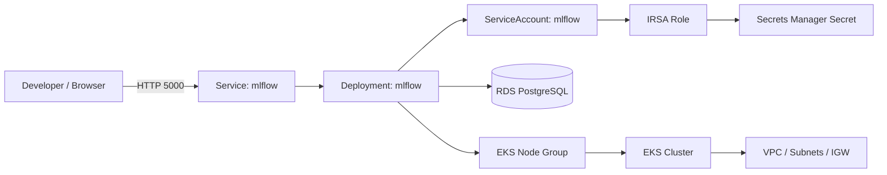

# MLflow on EKS Sandbox

This repository provisions a lightweight AWS EKS environment for MLflow and connects it to an RDS PostgreSQL database, Secrets Manager, and IRSA-based access.

## What this project creates

- An EKS cluster with a managed node group
- A VPC, subnets, internet gateway, and routing
- An RDS PostgreSQL instance for MLflow metadata
- A Secrets Manager secret containing the DB credentials
- An IAM role for service-account-based access to Secrets Manager (IRSA)
- A Kubernetes namespace, service account, Deployment, and Service for MLflow

## Architecture



## Repository layout

- [infrastructure/](infrastructure/) — Terraform code for AWS resources
- [k8s/](k8s/) — Kubernetes manifests for the MLflow app

## Prerequisites

Before you start, make sure you have:

- AWS CLI configured with sandbox credentials
- Terraform installed
- kubectl installed
- Access to the target AWS account and region

Verify your AWS CLI setup:

```bash
aws sts get-caller-identity
aws configure
```

## Deployment flow

### 1) Bootstrap the Terraform environment

Change into the infrastructure directory:

```bash
cd infrastructure
```

Initialize Terraform:

```bash
terraform init
```

Review the planned infrastructure:

```bash
terraform plan
```

Create the AWS resources:

```bash
terraform apply --auto-approve
```

After apply, note the outputs such as the cluster endpoint and RDS endpoint.

### 2) Configure kubectl for the new EKS cluster

Run the output command from Terraform:

```bash
aws eks update-kubeconfig --region us-west-2 --name sandbox-eks
```

If you changed the cluster name, use the value from Terraform output instead.

### 3) Apply the Kubernetes manifests

From the repo root:

```bash
cd ../k8s
kubectl apply -f namespace.yaml
kubectl apply -f mlflow-deployment.yaml
kubectl apply -f mlflow-service.yaml
```

### 4) Verify the deployment

Check the namespace and pods:

```bash
kubectl get ns mlflow
kubectl get pods -n mlflow
kubectl get svc -n mlflow
```

Inspect pod logs if needed:

```bash
kubectl logs -n mlflow deploy/mlflow
```

### 5) Access MLflow

Port-forward the service locally:

```bash
kubectl port-forward -n mlflow svc/mlflow 5000:5000
```

Then open:

```text
http://localhost:5000
```

## Terraform details

The Terraform stack provisions:

- EKS cluster and managed node group
- VPC with public subnets and an internet gateway
- RDS PostgreSQL instance for MLflow metadata
- Secrets Manager entry for the DB credentials
- OIDC provider for EKS and an IAM role for IRSA
- Kubernetes namespace and service account resources

Key files:

- [infrastructure/eks.tf](infrastructure/eks.tf)
- [infrastructure/iam.tf](infrastructure/iam.tf)
- [infrastructure/vpc.tf](infrastructure/vpc.tf)
- [infrastructure/rds.tf](infrastructure/rds.tf)
- [infrastructure/variables.tf](infrastructure/variables.tf)

## Kubernetes details

The MLflow Deployment uses an init container to fetch the database credentials from AWS Secrets Manager and write them to a shared volume. The main container then uses those values to start MLflow.

Key files:

- [k8s/namespace.yaml](k8s/namespace.yaml)
- [k8s/mlflow-deployment.yaml](k8s/mlflow-deployment.yaml)
- [k8s/mlflow-service.yaml](k8s/mlflow-service.yaml)

## Important notes

- The deployment uses a simple sandbox-friendly setup with public subnets and public IPs on worker nodes.
- The RDS instance is not publicly exposed, but it is reachable from the EKS VPC.
- The MLflow pod uses IRSA to read one secret from Secrets Manager.
- This is intended for learning and sandbox use, not production-grade networking or resilience.

## Cleanup

To remove everything created by Terraform:

```bash
cd infrastructure
terraform destroy --auto-approve
```

## Common commands

```bash
cd infrastructure
terraform init
terraform plan
terraform apply --auto-approve
terraform destroy --auto-approve
```

```bash
cd ../k8s
kubectl apply -f namespace.yaml
kubectl apply -f mlflow-deployment.yaml
kubectl apply -f mlflow-service.yaml
kubectl get pods -n mlflow
kubectl logs -n mlflow deploy/mlflow
kubectl port-forward -n mlflow svc/mlflow 5000:5000
```
