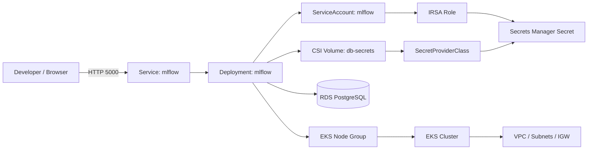

# MLflow on EKS Sandbox

This repository provisions a lightweight AWS EKS environment for MLflow and connects it to an RDS PostgreSQL database using Secrets Store CSI Driver with the AWS Secrets Manager provider (ASCP). This replaces the older approach of using a Python-based AWS CLI init container for secret retrieval.

## What this project creates

- An EKS cluster with a managed node group
- A VPC, subnets, internet gateway, and routing
- An RDS PostgreSQL instance for MLflow metadata
- A Secrets Manager secret containing the DB connection values
- An IAM role for service-account-based access to Secrets Manager (IRSA)
- The Secrets Store CSI Driver and AWS provider installed in the cluster
- A SecretProviderClass, Deployment, Service, and ingress routing for MLflow

## Architecture



## Repository layout

- [infrastructure/](infrastructure/) — Terraform code for AWS resources
- [k8s/](k8s/) — Kubernetes manifests for the MLflow app and CSI secret provider

## Prerequisites

Before you start, make sure you have:

- AWS CLI configured with sandbox credentials
- Terraform installed
- kubectl installed
- Helm installed
- Access to the target AWS account and region

Verify your AWS CLI setup:

```bash
aws sts get-caller-identity
aws configure
```

## Deployment flow

### 1) Bootstrap the Terraform environment

Change into the infrastructure directory:

```bash
cd infrastructure
```

Initialize Terraform:

```bash
terraform init
```

Review the planned infrastructure:

```bash
terraform plan
```

Create the AWS resources:

```bash
terraform apply --auto-approve
```

After apply, note the outputs such as the cluster endpoint, IRSA role ARN, and RDS endpoint.

#### Backend bootstrap (state storage)

Before running the main `infrastructure` Terraform configuration, create the remote backend objects (S3 bucket). Run the small bootstrap in `infrastructure/backend-bootstrap` first:

```bash
cd infrastructure/backend-bootstrap
terraform init
terraform apply --auto-approve

# The bootstrap creates the S3 bucket. Copy the `backend_config_block` output
# into the `terraform` block of `infrastructure/versions.tf` or pass it
# via `-backend-config` when running `terraform init` in `infrastructure`.
```

Note: DynamoDB-based locking is deprecated. The bootstrap output now recommends `use_lockfile = true` for S3-based locking.

### 2) Configure kubectl for the new EKS cluster

Run the output command from Terraform:

```bash
aws eks update-kubeconfig --region us-west-2 --name sandbox-eks
```

If you changed the cluster name, use the value from Terraform output instead.

### 3) Install the Secrets Store CSI driver and AWS provider

Install the CSI driver and the AWS Secrets Manager provider in the cluster:

```bash
helm repo add secrets-store-csi-driver https://kubernetes-sigs.github.io/secrets-store-csi-driver/charts
helm repo add aws-secrets-manager https://aws.github.io/secrets-store-csi-driver-provider-aws
helm repo update

helm upgrade --install csi-secrets-store secrets-store-csi-driver/secrets-store-csi-driver \
  --namespace kube-system --create-namespace

helm upgrade --install secrets-store-csi-driver-provider-aws aws-secrets-manager/secrets-store-csi-driver-provider-aws \
  --namespace kube-system --create-namespace \
  --set secrets-store-csi-driver.install=false
```

### 4) Install Traefik ingress controller

Add the Traefik Helm repository and install Traefik in its own namespace:

```bash
helm repo add traefik https://traefik.github.io/charts
helm repo update

kubectl create namespace traefik

helm install traefik traefik/traefik \
  --namespace traefik \
  --set ports.web.port=8000 \
  --set ports.websecure.port=8443 \
  --set service.type=LoadBalancer
```

### 5) Apply the Kubernetes manifests

From the repo root:

```bash
cd k8s
kubectl apply -f namespace.yaml
kubectl apply -f secret-provider-class.yaml
kubectl apply -f mlflow-deployment.yaml
kubectl apply -f mlflow-service.yaml
kubectl apply -f mlflow-ingressroute.yaml
```

### 6) Verify the deployment

Check the namespace, pods, and service:

```bash
kubectl get ns mlflow
kubectl get pods -n mlflow
kubectl get svc -n mlflow
```

Inspect pod logs if needed:

```bash
kubectl logs -n mlflow deploy/mlflow
```

### 7) Access MLflow

You can access MLflow either through the ingress route or by port-forwarding locally:

Via ingress:

```bash
kubectl get svc -n traefik
```

Then open the external address exposed by the Traefik LoadBalancer.

Or use port-forward:

```bash
kubectl port-forward -n mlflow svc/mlflow 5000:5000
```

Then open:

```text
http://localhost:5000
```

## Terraform details

The Terraform stack provisions:

- EKS cluster and managed node group
- VPC with public subnets and an internet gateway
- RDS PostgreSQL instance for MLflow metadata
- Secrets Manager entry for the DB credentials
- OIDC provider for EKS and an IAM role for IRSA
- Kubernetes namespace and service account resources

Key files:

- [infrastructure/eks.tf](infrastructure/eks.tf)
- [infrastructure/iam.tf](infrastructure/iam.tf)
- [infrastructure/vpc.tf](infrastructure/vpc.tf)
- [infrastructure/rds.tf](infrastructure/rds.tf)
- [infrastructure/variables.tf](infrastructure/variables.tf)

## Kubernetes details

The MLflow Deployment mounts database credentials from AWS Secrets Manager through a CSI volume. The mounted files are read directly by the MLflow container from the path /mnt/secrets, so no AWS CLI or Python-based secret-fetching init container is required.

- [k8s/namespace.yaml](k8s/namespace.yaml)
- [k8s/secret-provider-class.yaml](k8s/secret-provider-class.yaml)
- [k8s/mlflow-deployment.yaml](k8s/mlflow-deployment.yaml)
- [k8s/mlflow-service.yaml](k8s/mlflow-service.yaml)
- [k8s/mlflow-ingressroute.yaml](k8s/mlflow-ingressroute.yaml)

## Important notes

- The deployment uses a simple sandbox-friendly setup with public subnets and public IPs on worker nodes.
- The RDS instance is not publicly exposed, but it is reachable from the EKS VPC.
- The MLflow pod uses IRSA to read one secret from Secrets Manager through the CSI volume.
- This is intended for learning and sandbox use, not production-grade networking or resilience.

## Cleanup

To remove everything created by Terraform:

```bash
cd infrastructure
terraform destroy --auto-approve
```

## Common commands

```bash
cd infrastructure
terraform init
terraform plan
terraform apply --auto-approve
terraform destroy --auto-approve
```

```bash
cd k8s
helm repo add secrets-store-csi-driver https://kubernetes-sigs.github.io/secrets-store-csi-driver/charts
helm repo add aws-secrets-manager https://aws.github.io/secrets-store-csi-driver-provider-aws
helm repo update
helm upgrade --install csi-secrets-store secrets-store-csi-driver/secrets-store-csi-driver --namespace kube-system --create-namespace
helm upgrade --install secrets-store-csi-driver-provider-aws aws-secrets-manager/secrets-store-csi-driver-provider-aws --namespace kube-system --create-namespace --set secrets-store-csi-driver.install=false
kubectl apply -f namespace.yaml
kubectl apply -f secret-provider-class.yaml
kubectl apply -f mlflow-deployment.yaml
kubectl apply -f mlflow-service.yaml
kubectl get pods -n mlflow
kubectl logs -n mlflow deploy/mlflow
kubectl port-forward -n mlflow svc/mlflow 5000:5000
```
